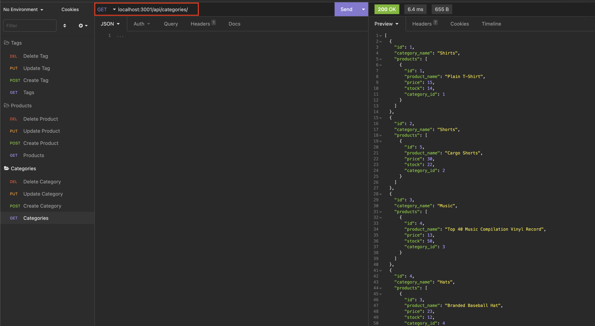
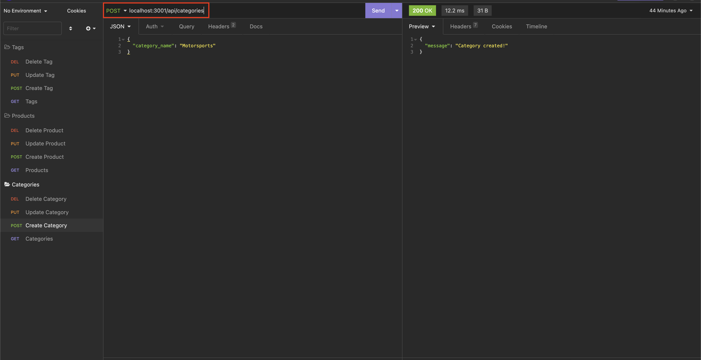
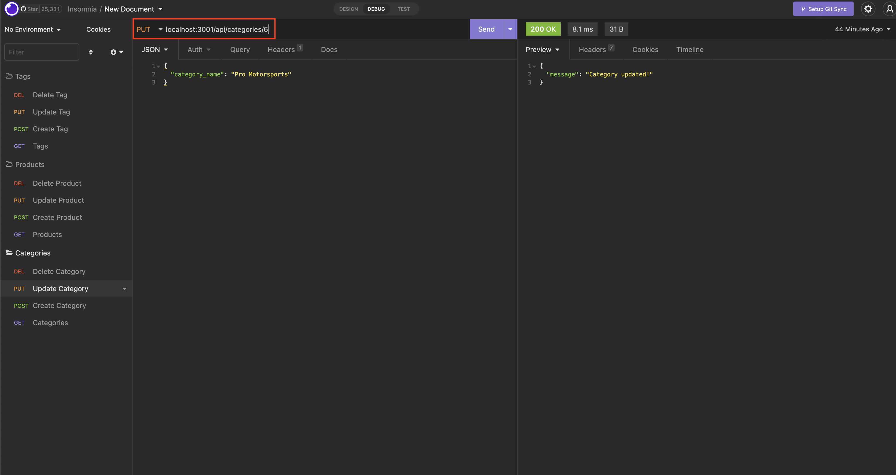
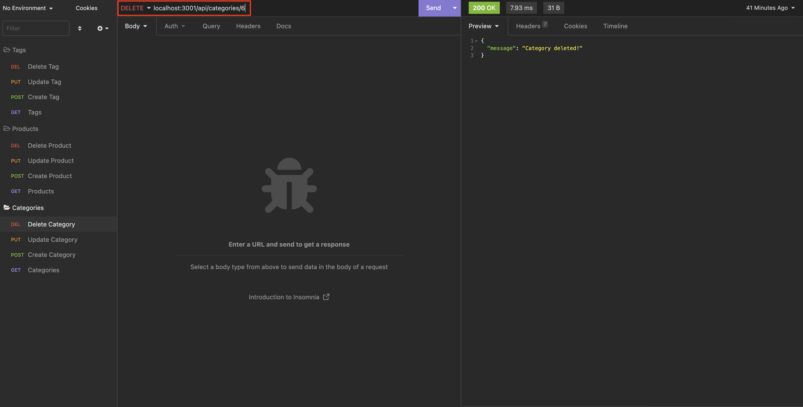

# WEB STORE - SEQUELIZE CRUD OPERATIONS

[](https://opensource.org/licenses/ISC)

## Description

This application allows the user to perform CRUD operations via Insomnia or using JSON files to a MySql DB.

[Go to Video](https://drive.google.com/file/d/1S_JswWsGdrmRLUKOEfOC18DOkx98t3jG/view?usp=share_link)


- [Installation](#installation)
- [Usage](#usage)
- [Licences](#licenses)
- [Contributing](#contributing)
- [Tests](#tests)
- [Questions](#questions)

-- 

## Installation

1. Clone the main project via the HTTP or SSH link on github.  
```git clone```
2. Install all npm dependencies from the terminal.  
```npm install```
3. Add the DB credentials for your local DB on server.js.
```
const conn = mysql.createConnection(
    {
      host: 'localhost',
      user: '',      // add your DB user
      password: '',  // add the password for user
      database: 'ecommerce_db' .
    },
    console.log(`Connected to ecommerce_db database.`)
  );
```
4. Execute schema.sql file, log into MySql in your terminal and execute db/schema.sql  to create the DB.
```
mysql -u root -p
Enter password: <your password>

mysql> source <your path to the project>/db/schema.sql
```

5. Execute seeds/index.js to populate the DB (optional).
```
node <your path to the project>/seeds/index.js
```
-- 

## Usage

1. Run the application using the terminal.  
```npm start```

2. To execute a GET request use the following paths:  
localhost:3001/api/categories/ or localhost:3001/api/categories/:id  
localhost:3001/api/products/   or localhost:3001/api/products/:id  
localhost:3001/api/tags/       or localhost:3001/api/tags/:id  

  
3. To execute a POST (create) request use the following paths (sending the respective JSON entry):  
localhost:3001/api/categories/  
localhost:3001/api/products/  
localhost:3001/api/tags/  

  
4. To execute a PUT (update) request use the following paths (sending the respective JSON entry):  
localhost:3001/api/categories/:id  
localhost:3001/api/products/:id  
localhost:3001/api/tags/:id  


5. To execute a DELETE (erase) request use the following paths:  
localhost:3001/api/categories/:id  
localhost:3001/api/products/:id  
localhost:3001/api/tags/:id  

-- 

## Licenses

### ISC
https://opensource.org/licenses/ISC

-- 

## Contributing

Jaime Esquivel https://github.com/jaime-a-esquivel-a

--

## Tests

No tests were developed for this app.

--

## Questions

Please contact the author:

Name: Jaime Esquivel

e-mail: jaime.a.esquivel.a@gmail.com

GitHub User: https://github.com/jaime-a-esquivel-a

GitHub Repo: https://github.com/jaime-a-esquivel-a/CMS

